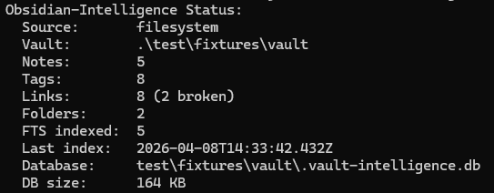
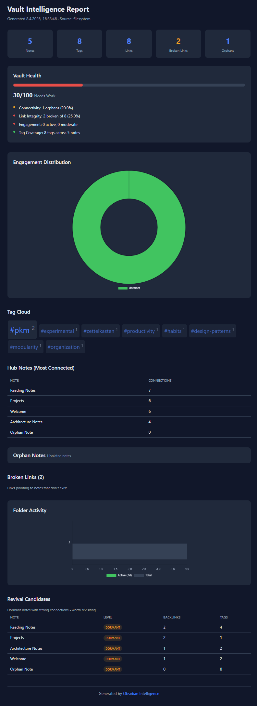

# Obsidian Intelligence

> **Make your Obsidian vault a first-class knowledge source for any MCP-enabled AI assistant. Local, private, headless.**

[](https://www.npmjs.com/package/obsidian-intelligence)
[](https://www.npmjs.com/package/obsidian-intelligence)
[](https://github.com/GuideThomas/obsidian-intelligence/actions/workflows/ci.yml)
[](LICENSE)
[](#requirements)
[](#tests)
[](https://modelcontextprotocol.io)

Your Obsidian vault is your most valuable knowledge base. But no AI assistant can read it — not without uploading your notes to some cloud service.

**Obsidian Intelligence** turns your vault into a [Model Context Protocol](https://modelcontextprotocol.io) server. Any MCP-enabled AI client (Claude Desktop, Claude Code, Cursor, OpenWebUI, Cline, Continue.dev, ChatGPT Desktop) can then search, analyze, and reason over your vault — *without your notes ever leaving your machine*.

```
┌─────────────────────────────────────────────────────────────┐
│  Your AI client (Claude Desktop / Code / Cursor / OpenWebUI)│
│                          ↕  MCP                             │
│              obsidian-intelligence (this tool)              │
│                          ↕                                  │
│         your vault  +  local SQLite index                   │
└─────────────────────────────────────────────────────────────┘
```

<p align="center">
  
  <br/>
  <em>The CLI at a glance — <code>vault-intelligence status</code> on the bundled test fixture vault.</em>
</p>

<p align="center">
  
  <br/>
  <em>The self-contained HTML report (<code>vault-intelligence report</code>) — dark theme, Chart.js visualizations, health score, engagement buckets, tag cloud. Works offline.</em>
</p>

## Why this exists

The AI tooling ecosystem just converged on a shared standard: MCP. What was an Anthropic experiment six months ago is now the de-facto interface across Claude Desktop, Claude Code, Cursor, OpenWebUI, and a growing list of clients.

That means **one MCP server, configured once, works everywhere**. Set up `obsidian-intelligence` once in your favorite client's config, and from then on every chat, every coding agent, every workflow has structured access to your own knowledge base.

Imagine asking Claude Code in your editor:
> *"Which notes from my vault are relevant to what I'm building right now?"*
> *"Did I write something about database migrations? Search semantically."*
> *"Which dormant notes could I connect to this current project?"*

Or asking Claude Desktop on a Sunday evening:
> *"Look at the notes I touched in the last 6 days and write me a weekly review prompt."*

Or building an OpenWebUI agent that opens every conversation with *"this question shows up in 4 of your older notes"*.

Each of these works without writing any code — once MCP is connected, your vault is part of the context.

## What you get

### 13 MCP tools, ready to use

| Tool | What it does |
|---|---|
| `vault_status` | Quick overview: note count, tags, links, indexes |
| `vault_snapshot` | Full JSON snapshot for complex queries |
| `find_orphans` | Notes with no connections |
| `find_hubs` | Best-connected notes — the structural anchors |
| `find_backlinks` | Who links to a note? |
| `find_related` | Related notes via shared tags and links |
| `get_tag_cloud` | Tag statistics |
| `find_notes_by_tag` | All notes with a tag |
| `engagement_stats` | Activity distribution + revival candidates |
| `list_catalysts` | Open AI-generated reflection questions |
| `search_content` | **FTS5 full-text search** with BM25 ranking, snippets |
| `semantic_search` | **Vector similarity** — finds meaning, not just words |
| `hybrid_search` | **RRF-fused keyword + semantic** — usually the best default |

Each tool is available the moment your MCP client connects. The assistant decides which one to call.

### Beyond MCP

- **CLI** for cron, CI, scripts, your own pipelines
- **Self-contained HTML report** with charts (engagement donut, tag cloud, hub ranking, health score) — one file you regenerate monthly
- **JSON snapshot export** for downstream tooling
- **Watch mode** for automatic re-indexing
- **CouchDB adapter** for [Obsidian LiveSync](https://github.com/vrtmrz/obsidian-livesync) users
- **Optional document ingestion** ([obsidian-intelligence-docs](packages/docs-ingest/), text/markdown/html — pdf/docx in v1.2)

## The privacy story

Other RAG products say *"upload your notes and we'll search them for you"*. We do the opposite: **your notes stay where they are. The AI assistant comes to the vault, not the other way around.**

| What | Where it runs |
|---|---|
| Indexing | 100% local (SQLite) |
| Full-text search (FTS5) | 100% local |
| Graph analysis | 100% local |
| Semantic search (embeddings) | **Your choice**: local Ollama, or Gemini free tier, or OpenAI |
| LLM enrichment | Same choice |
| Catalysts (reflection questions) | Same choice — sends only structural metadata, not note content |
| MCP server | Local stdio subprocess of your AI client. No network ports, no daemon. |

You can run the entire tool without an API key. With Ollama installed locally (`ollama pull nomic-embed-text` and any chat model), you get the full feature set including semantic search, fully air-gapped.

**No telemetry. No phone-home. No update checks.** When you `npm install -g obsidian-intelligence`, that's the first and last connection to anything I control.

## Quick start

### 60 seconds: install and index

```bash
# Install globally
npm install -g obsidian-intelligence

# Index your vault
vault-intelligence index --vault /path/to/your/vault

# See what's there
vault-intelligence status
vault-intelligence graph orphans
vault-intelligence search "your query"
vault-intelligence report --open    # opens HTML report in browser
```

Or skip the install and run directly with `npx`:

```bash
VAULT_PATH=/path/to/your/vault npx obsidian-intelligence index
VAULT_PATH=/path/to/your/vault npx obsidian-intelligence status
```

No API key needed for any of that.

### 90 seconds: hook it into Claude Desktop

Add to `claude_desktop_config.json` (find it via Settings → Developer → Edit Config):

```json
{
  "mcpServers": {
    "obsidian": {
      "command": "node",
      "args": ["/usr/local/lib/node_modules/obsidian-intelligence/mcp-server.mjs"],
      "env": {
        "VAULT_PATH": "/Users/you/Documents/MyVault"
      }
    }
  }
}
```

Restart Claude Desktop. Now ask:

> *"What are my best-connected notes?"*
> *"Search my vault for anything about database migrations."*
> *"Find notes related to the one called 'Project X kickoff'."*

### Other MCP clients

The same MCP server config pattern works in **Claude Code**, **Cursor**, **OpenWebUI**, **Cline**, **Continue.dev**, and any other MCP-faehigen client. See [docs/MCP_SETUP.md](docs/MCP_SETUP.md) for client-specific instructions.

### Adding semantic search

Semantic search needs embeddings. Three setups, pick whichever fits:

**Local (Ollama, free, air-gapped):**
```bash
# Install Ollama from https://ollama.com, then:
ollama pull nomic-embed-text

export EMBEDDINGS_PROVIDER=ollama
vault-intelligence embed run     # generates embeddings for all notes
vault-intelligence embed search "your query"
```

**Cloud (Gemini, free tier):**
```bash
export EMBEDDINGS_PROVIDER=gemini
export GEMINI_API_KEY=your-key
vault-intelligence embed run
```

**Cloud (OpenAI):**
```bash
export EMBEDDINGS_PROVIDER=openai
export LLM_API_KEY=sk-...
vault-intelligence embed run
```

After that, the `semantic_search` and `hybrid_search` MCP tools work in your AI client.

## Configuration

All configuration is via environment variables, optionally in a `.env` file. See [`.env.example`](.env.example) for the full list.

### Minimal config (filesystem-only, no API keys)

```bash
VAULT_PATH=/path/to/your/vault
```

That's it. Indexing, graph queries, FTS search, engagement, and HTML reports all work.

### Provider matrix

| Feature | Filesystem | Ollama (local) | Gemini (free) | OpenAI |
|---|:---:|:---:|:---:|:---:|
| Indexing | ✓ | ✓ | ✓ | ✓ |
| Graph queries | ✓ | ✓ | ✓ | ✓ |
| Full-text search | ✓ | ✓ | ✓ | ✓ |
| Engagement tracking | ✓ | ✓ | ✓ | ✓ |
| HTML reports | ✓ | ✓ | ✓ | ✓ |
| Semantic search | — | ✓ | ✓ | ✓ |
| Hybrid search (RRF) | partial* | ✓ | ✓ | ✓ |
| LLM enrichment | — | ✓ | ✓ | ✓ |
| Catalyst questions | — | ✓ | ✓ | ✓ |
| MCP server | ✓ | ✓ | ✓ | ✓ |

*Hybrid search falls back gracefully to keyword-only when no embeddings are available.

## CLI reference

```
vault-intelligence index [--force] [--vault <path>]    Full index
vault-intelligence index --rebuild-fts                 Rebuild FTS index
vault-intelligence status                              Show statistics
vault-intelligence test                                Test connections
vault-intelligence report [--output <file>] [--open]   HTML report

vault-intelligence search <query> [--hybrid] [--limit N] [--folder p] [--tag t]
vault-intelligence embed run [limit] [batch_size]      Generate embeddings
vault-intelligence embed similar <note-id>             Find similar notes
vault-intelligence embed search <query>                Semantic search
vault-intelligence enrich run [limit] [delay_ms]       LLM enrichment
vault-intelligence enrich stats                        Enrichment stats

vault-intelligence graph orphans                       Notes without connections
vault-intelligence graph hubs [n]                      Top connected notes
vault-intelligence graph backlinks <note>              Incoming links
vault-intelligence graph related <note>                Related via tags+links
vault-intelligence graph tags [filter]                 Tag cloud

vault-intelligence engagement stats                    Activity distribution
vault-intelligence catalyst generate [n]               Generate AI questions
vault-intelligence proactive [summary|active|revival]  What to look at now
vault-intelligence snapshot [path]                     JSON snapshot
vault-intelligence watch                               Watch mode
```

Run `vault-intelligence --help` for the full list.

## How it compares

| | Smart Connections | RAG-as-a-Service | Custom Python script | **Obsidian Intelligence** |
|---|---|---|---|---|
| Lives where? | Inside Obsidian (plugin) | Cloud | Your machine | Your machine |
| MCP-native? | No | No | No (you'd build it) | **Yes (13 tools)** |
| Multi-client? | Obsidian only | Vendor-locked | One-off | **Any MCP client** |
| Local-by-default? | Partial | No | Yes | **Yes** |
| Graph + FTS + Semantic + Hybrid? | Semantic only | Varies | Build it yourself | **All four** |
| Headless? | No | N/A | Yes | **Yes** |
| Open source? | Yes | Mostly no | Yours | **Yes (MIT)** |
| Telemetry? | Optional | Yes | No | **No** |

## Requirements

- Node.js **>= 18**
- An Obsidian vault (or a CouchDB database from [Obsidian LiveSync](https://github.com/vrtmrz/obsidian-livesync))
- Optional: an LLM provider for catalysts/enrichment (Ollama, OpenAI-compatible API, or Gemini)
- Optional: an embeddings provider for semantic search (same options)

## Documentation

- [docs/MCP_SETUP.md](docs/MCP_SETUP.md) — Client-specific MCP setup
- [docs/PROVIDERS.md](docs/PROVIDERS.md) — LLM and embeddings provider matrix
- [docs/PRIVACY.md](docs/PRIVACY.md) — What goes where, in detail
- [docs/ARCHITECTURE.md](docs/ARCHITECTURE.md) — How it's wired internally
- [CHANGELOG.md](CHANGELOG.md) — Release notes

## Contributing

Contributions welcome — see [CONTRIBUTING.md](CONTRIBUTING.md). Bug reports, feature requests, and questions all live in [GitHub Issues](https://github.com/GuideThomas/obsidian-intelligence/issues).

## Acknowledgements

Built on the shoulders of:

- [@modelcontextprotocol/sdk](https://github.com/modelcontextprotocol/typescript-sdk) — the MCP protocol and reference server implementation
- [better-sqlite3](https://github.com/WiseLibs/better-sqlite3) — the fast, synchronous SQLite binding that makes indexing feel instant
- [Chart.js](https://www.chartjs.org/) — the charts in the HTML report
- [dotenv](https://github.com/motdotla/dotenv) — zero-config env loading
- [chokidar](https://github.com/paulmillr/chokidar) — optional filesystem watcher

And of course the [Obsidian](https://obsidian.md) community, whose plugins,
vaults, and conversations shaped the design.

## License

[MIT](LICENSE)

## Trademarks

This project is an independent, community-built tool. It is **not affiliated
with, endorsed by, or sponsored by Obsidian.md or Dynalist Inc.** "Obsidian"
is a trademark of its respective owner and is used here nominatively to
describe compatibility. All other trademarks are the property of their
respective owners.

---

*Built by [Thomas Winkler](https://thomaswinkler.art). Originally a personal tool for a 6,000-note vault — now hopefully useful to you too.*

*Part of the [inntal-ki](https://github.com/inntal-ki) open-source family — local, private AI tooling for small and medium businesses. See [inntal-ki.com](https://inntal-ki.com).*
